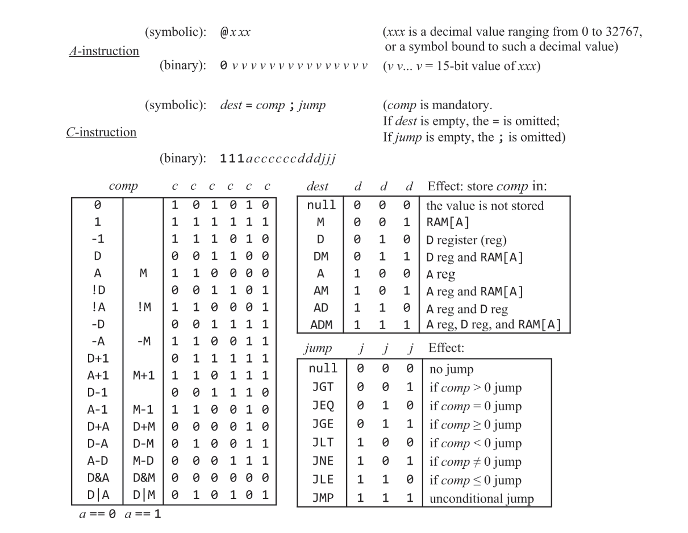
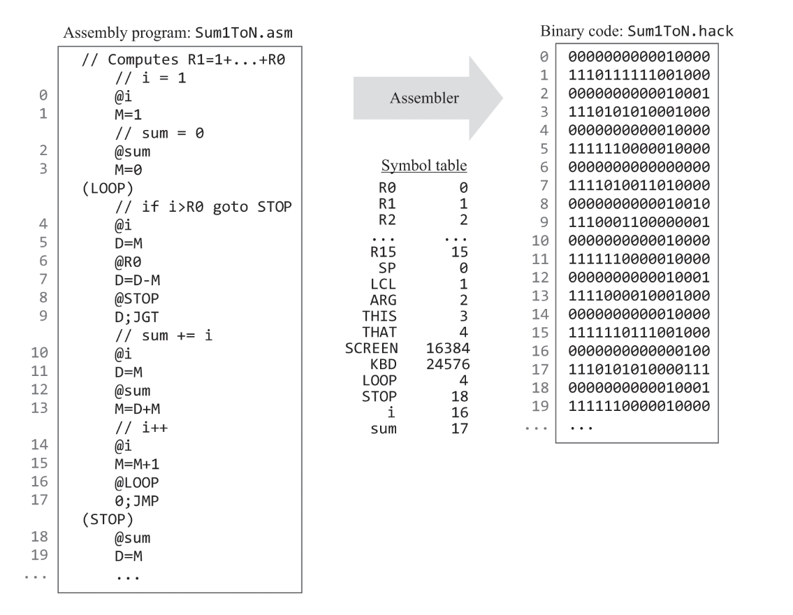

# Hack Assembler

Assembler that translates programs written in Hack assembly language into Hack binary code.

## Usage
```bash
$ ./init.sh                                 # build code
$ ./build/assembler tests/Add.asm           # run executable
$ cat tests/Add.hack                        # show results
$ diff tests/Add.hack tests/sols/Add.hack   # compare results with solutions from book

$ ./build/assembler tests/PongL.asm         # huge example (27k lines)
```

### Add.asm -> Add.hack
```
@2          |       0000000000000010
D=A         |       1110110000010000
@3          |       0000000000000011 
D=D+A       |       1110000010010000
@0          |       0000000000000000
M=D         |       1110001100001000
```

## Specification


